Project is not ready yet, minor bugs needs to be fixed | not for free use

# **ELECTROZON - Ecommerce Website**

## Features :

# *:-:-:-:-:-:-:-:-:* Front - End *:-:-:-:-:-:-:-:-:*

* Responsive Layout
* Shopping Cart (for visiter loggedin | not loggedin)
* Product attributes: cost price, current offer price, quantity,    estimated delivey time, long description
* Shop by category, tag (new arrivals), recommended for user
* Module/Extension: Shipping (with tracking), payments.
* Contact form
* Related Products, Recommendations for you in our categories
* Efficient Product search
* New user Email Authentication
* Payment integration(payu)

 

# *:-:-:-:-:-:-:-:-:* Admin *:-:-:-:-:-:-:-:-:*

* Category Management
* Sub-Category Management
* Product Manager
* Order Management
* Shipping Management 
* Custimer Address Management
* Customer Management
* Config: email setting
* Generate Order Pdf
* Banner Manager 
* Profile settings and Many more..

 
 

# Screenshots :

## **Home**
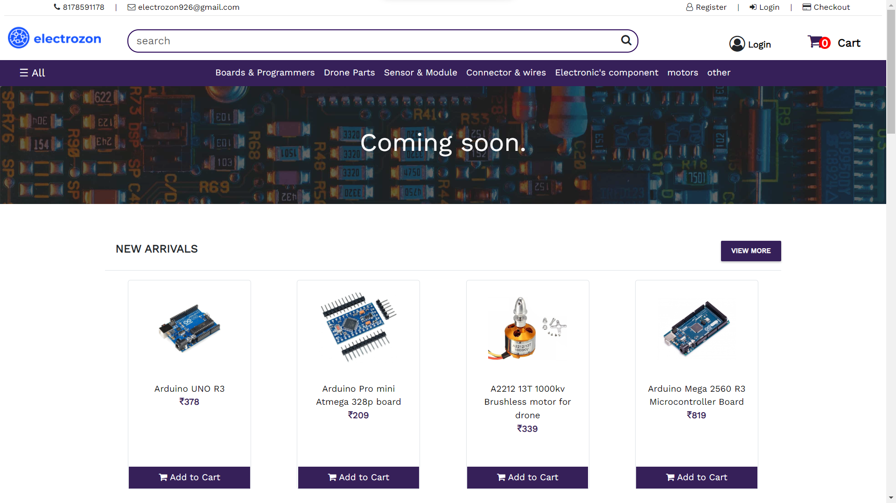
 
 

## **Product**
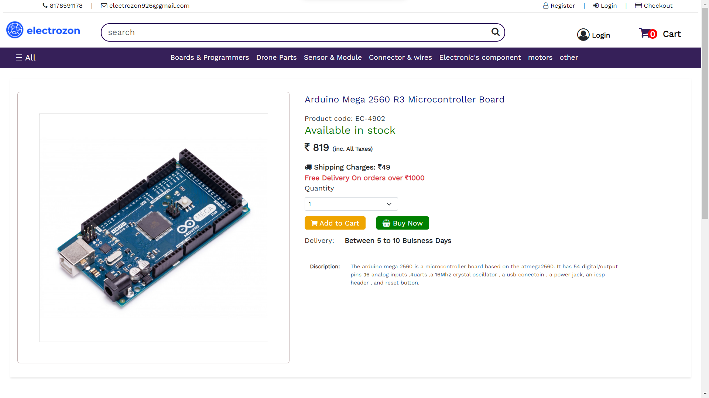
 
 

## **Shop By Category**
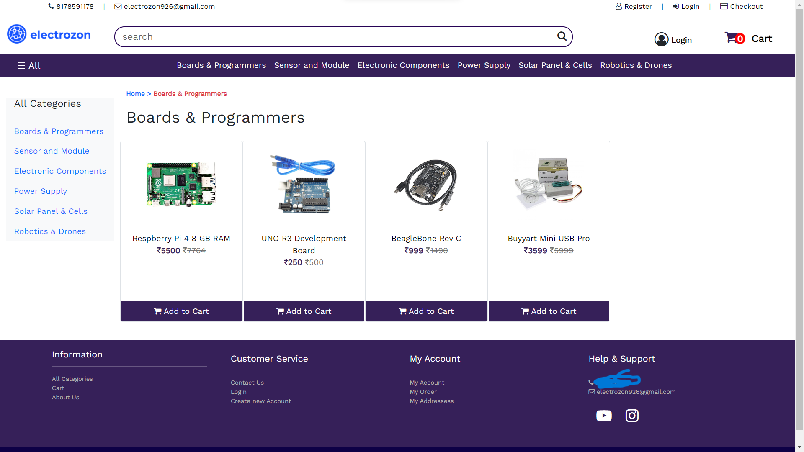
 
 

## **Cart**
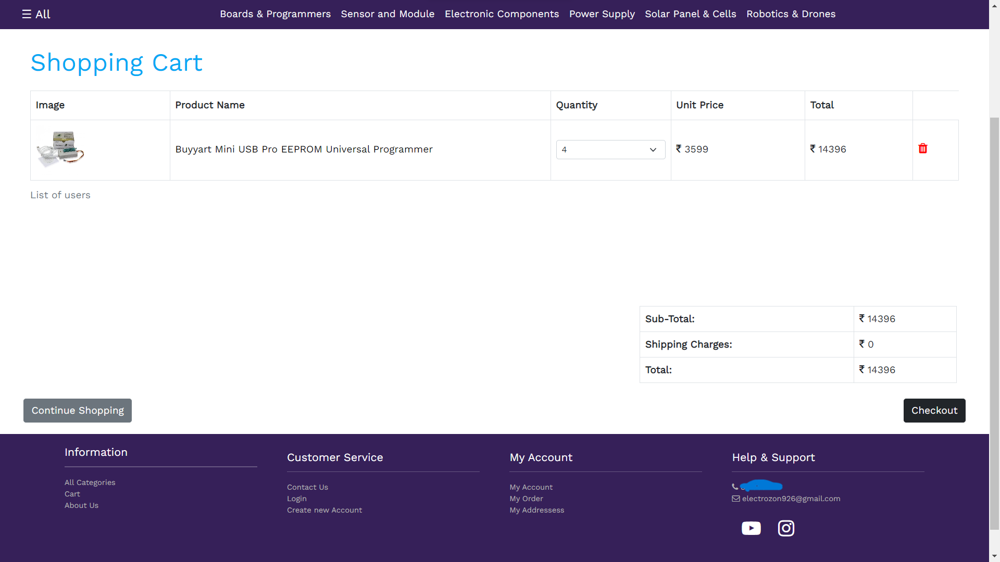
 
 

## **Lazy Loading**
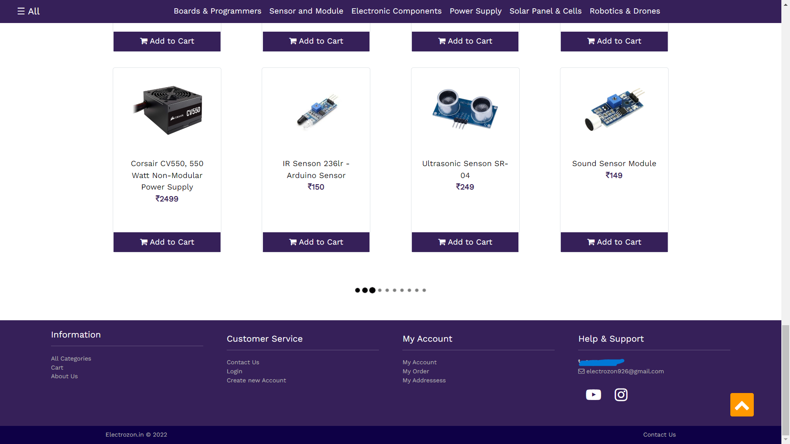
 
 

## **Orders Places**
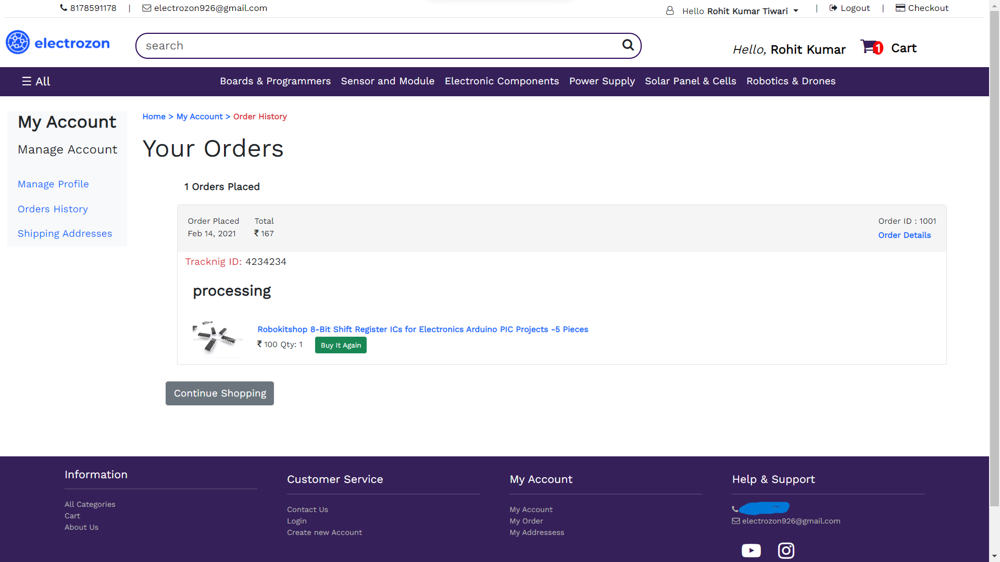
 
 

## **Address Management**
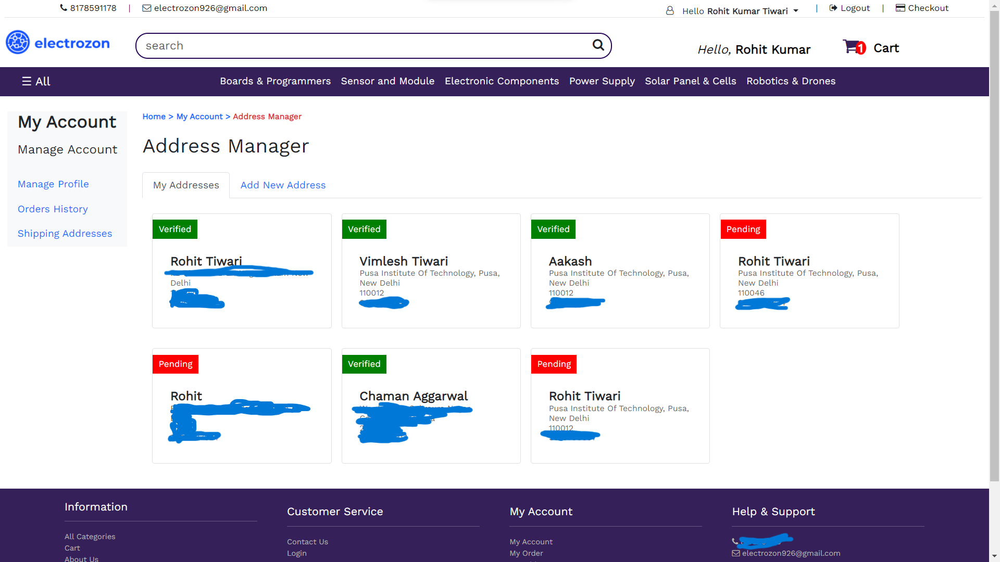
 
 

## **Add New Address**
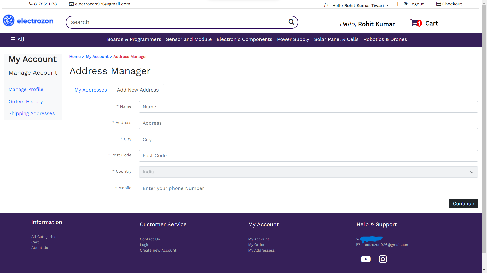
 
 

## **Account Management**
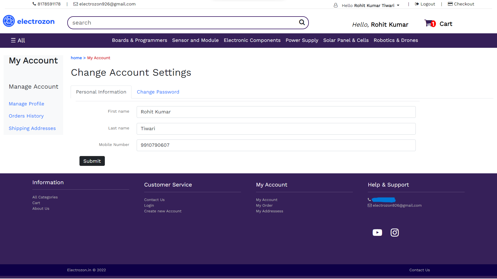
 
 

## **Update Password**
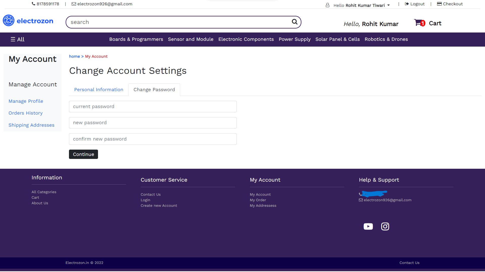
 
 

## Responsive Designs

## **Home**
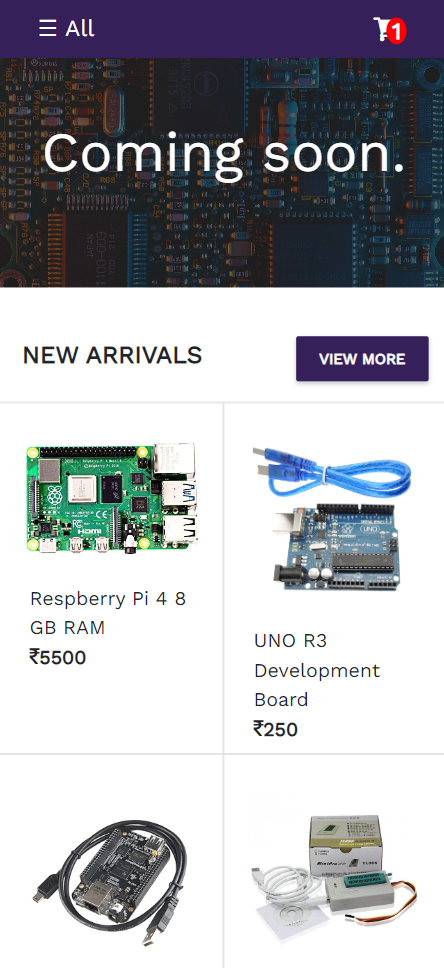
 
 

## **Cart**
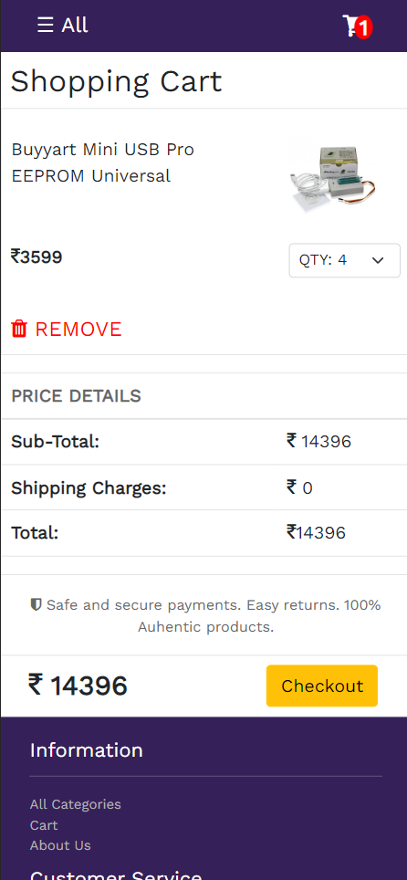
 
 

## **Product**
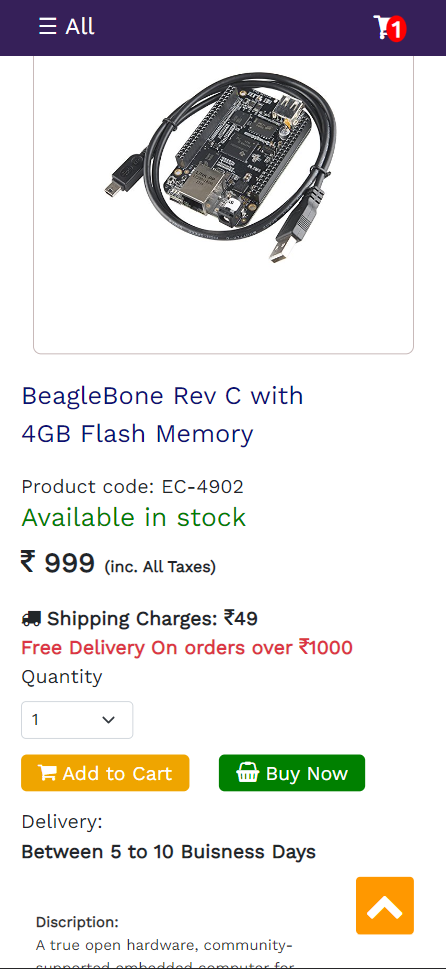
 
 

## **Shop By Category**
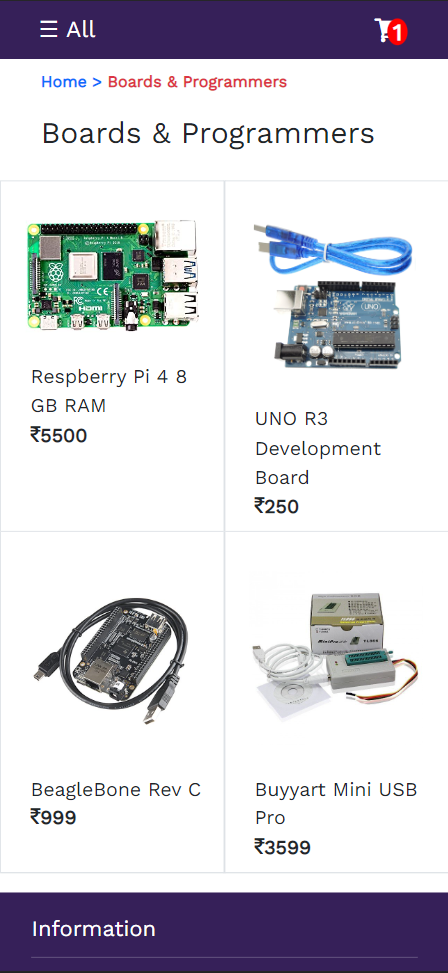
 
 

## **Humburger Menu**
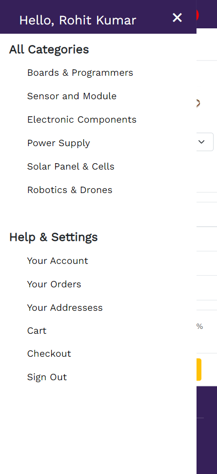
 
 
